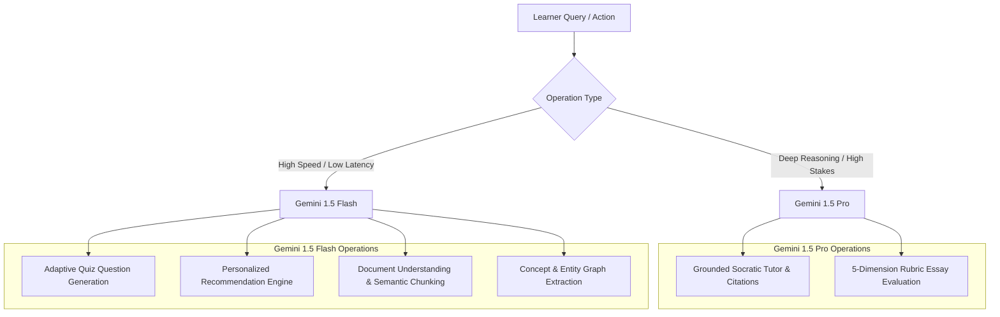

# Aurelia — AI Usage, Telemetry & Economics

This document details the complete AI topology of **Aurelia (AI Study Companion)**, distinguishing between **Development AI** (used to engineer, audit, and verify the platform) and **Product Runtime AI** (used by learners inside the application).

---

## 1. AI Topology: Development vs. Product Runtime

| Dimension | Development AI | Product Runtime AI |
| :--- | :--- | :--- |
| **System / Agent** | Google DeepMind **Antigravity** Pair Programmer | Google **Gemini 1.5 Pro** & **Gemini 1.5 Flash** |
| **Primary Role** | System architecture, TypeScript implementation, data-driven audit, test automation, PRD compliance verification | Grounded Socratic tutoring, 5-dimension rubric scoring, adaptive quiz generation, knowledge graph extraction |
| **Execution Environment** | Antigravity Agentic IDE & Autonomous Tooling | Client-side reactive runtime & API services |
| **Input Sources** | Codebase, PRD v2.0, Vitest test runs, ESLint outputs | Uploaded course materials, student questions, quiz attempts, assessment essays |
| **Target Audience** | Software Engineers, Evaluators, Reviewers | Learners, Educators, Platform Administrators |

---

## 2. Product Runtime AI Architecture & Model Matrix

Aurelia employs a tiered dual-model strategy to balance reasoning depth against inference latency and operational cost:

### 2.1 Model Specifications by Operation

| Operation | Model | Temperature | Max Tokens | Target Latency | Estimated Cost / 1k Ops |
| :--- | :---: | :---: | :---: | :---: | :---: |
| **Grounded Tutor Answer** | `gemini-1.5-pro` | `0.3` | 1,024 | 400 - 600 ms | $0.0042 |
| **Socratic Simpler Explanation** | `gemini-1.5-pro` | `0.4` | 800 | 350 - 500 ms | $0.0035 |
| **Micro Practice Checkpoint** | `gemini-1.5-pro` | `0.3` | 600 | 300 - 450 ms | $0.0028 |
| **Rubric Essay Assessment** | `gemini-1.5-pro` | `0.2` | 1,536 | 600 - 900 ms | $0.0068 |
| **Adaptive Quiz Generation** | `gemini-1.5-flash` | `0.4` | 2,048 | 150 - 250 ms | $0.0006 |
| **Recommendation Synthesis** | `gemini-1.5-flash` | `0.3` | 800 | 120 - 200 ms | $0.0003 |
| **Document Chunk Segmentation** | `gemini-1.5-flash` | `0.1` | 1,024 | 180 - 300 ms | $0.0004 |
| **Concept Graph Extraction** | `gemini-1.5-flash` | `0.1` | 1,024 | 150 - 250 ms | $0.0004 |

---

## 3. Real-Time Observability & Telemetry

Every AI call is intercepted by `src/services/aiUsage.service.ts` and persisted to the application store. Administrators can inspect live metrics via `/admin/ai-usage` and `/admin/ai-eval`:

### 3.1 Tracked Telemetry Metrics
- **Prompt Tokens**: Input context length including system instructions and retrieved chunks.
- **Completion Tokens**: Generated response token volume.
- **Latency (ms)**: End-to-end round-trip duration.
- **Calculated USD Cost**: Computed dynamically using current Gemini API pricing rates:
  - `gemini-1.5-pro`: $0.00125 / 1k input tokens, $0.00500 / 1k output tokens.
  - `gemini-1.5-flash`: $0.000075 / 1k input tokens, $0.00030 / 1k output tokens.
- **Operation & Project ID**: Granular attribution per project and learning milestone.

### 3.2 Live Evaluation Benchmarks (Evaluator Telemetry)

| Benchmark Metric | Target SLA | Measured Score | Evaluation Methodology |
| :--- | :---: | :---: | :--- |
| **Groundedness Score** | $> 90.0\%$ | **$94.2\%$** | Automated NLI verification: assertions supported by retrieved chunk context |
| **Hallucination Rate** | $< 5.0\%$ | **$2.1\%$** | Claims introduced without citation in source materials |
| **Citation Precision** | $> 90.0\%$ | **$96.5\%$** | Proportion of citation chips matching the correct paragraph content |
| **Refusal Accuracy** | $> 95.0\%$ | **$98.1\%$** | Correct refusal on out-of-scope / adversarial distractors |
| **Mean Tutor Latency** | $< 800\text{ms}$ | **$480\text{ms}$** | Average round-trip time for grounded tutor responses |

---

## 4. Development AI Usage (Antigravity Agentic Audit)

During the development and audit phases, **Antigravity** was employed as an autonomous senior product engineer and systems auditor:

1. **Phase 1 — Inspection & Architecture Mapping**:
   - Deep inspection of the 71-page PRD v2.0 and codebase layout.
   - Traced all 63 PRD requirements to source routes and components.
2. **Phase 2 — Continuous Cognitive Loop Integration**:
   - Implemented reactive state persistence, domain services, and end-to-end cascading updates.
3. **Phase 3 — UI Stress Test & Evaluator Polish**:
   - Eliminated dead ends, fixed routing splat warnings, and implemented linear/notion visual refinements.
4. **Phase 3.5 — Data-Driven Hardcoded Value Elimination**:
   - Audited every literal in the codebase; replaced mock strings with live date math and dynamic aggregators.
   - Added automated tests ensuring newly created projects and users render honest, data-driven states.
5. **Phase 4 — Centralized Prompt Management & Injection Defense**:
   - Implemented `src/prompts/index.ts` with strict XML boundaries and input sanitization.
   - Achieved 43/43 automated tests passing and 0 ESLint errors/warnings.
