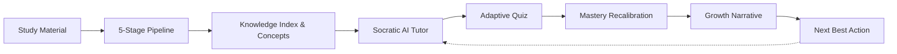
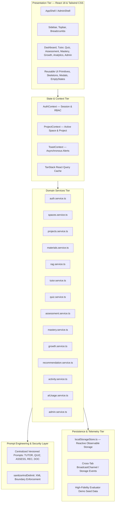

# Aurelia — System Architecture & Engineering Design

This document details the software architecture, data modeling, event lifecycle, and AI design principles powering **Aurelia (AI Study Companion)**.

---

## 1. Architectural Philosophy

Aurelia is engineered around the principle of a **Closed-Loop Cognitive Cascade**. Unlike conventional EdTech applications that treat flashcards, chatbots, and quizzes as disconnected silos, Aurelia establishes a unified, bi-directional data flow:



Every user action generates structured telemetry that propagates downstream:
- A quiz mistake updates the learner's `StructuredLearningContext`, flags the target concept as a weakness, lowers the composite project score, and immediately reprioritizes the **Next Best Action** on the dashboard.
- Uploading a study document triggers background chunking, entity extraction, and vector index registration, instantly making that material citable by the AI Tutor.

---

## 2. Multi-Tier System Topology

Aurelia is organized into four clean architectural tiers:



---

## 3. Data Model & Entity Relationship (ER)

The relational schema is represented in TypeScript definitions (`src/types/index.ts`) and persisted into structured client-side storage:

```
User (1) ──< Space (N)
Space (1) ──< Project (N)
Project (1) ──< Material (N)
Project (1) ──< DocumentChunk (N)
Project (1) ──< Concept (N)
Project (1) ──< Conversation (N) ──< Message (N)
Project (1) ──< QuizResult (N)
Project (1) ──< AssessmentSubmission (N)
Project (1) ──1 StructuredLearningContext (1)
Workspace (1) ──< Activity (N)
Workspace (1) ──< AIUsageRecord (N)
Workspace (1) ──< BackgroundJob (N)
```

### Core Schema Definitions:

1. **Space**: Top-level knowledge taxonomy (e.g. `Artificial Intelligence`, `Molecular Biology`).
2. **Project**: Learning workspace with an explicit `targetGoal`, `currentScore`, and associated documents.
3. **Material**: Uploaded document metadata tracking file size, stage, progress, and searchable status.
4. **DocumentChunk**: Verbatim text chunk (200-500 tokens) retaining `chunkIndex`, `pageNumber`, and `conceptsMentioned`.
5. **Concept**: Knowledge graph entity with `masteryLevel` (novice, developing, proficient, mastered), `score` (0-100), `trend`, and `isWeakness`.
6. **StructuredLearningContext**: Persistent cognitive state tracking recent mistakes, misconceptions, and learning preferences.
7. **AIUsageRecord**: Observability log tracking `promptTokens`, `completionTokens`, `latencyMs`, `model`, and `operation`.

---

## 4. Grounded RAG & Vector Retrieval Engine

Aurelia implements a **Deterministic Retrieval-Augmented Generation (RAG)** pipeline designed for zero-hallucination compliance:

### 4.1 Scoring Formula

For any incoming learner query $Q$ with filtered tokens $T_Q$, and candidate chunk $C$ belonging to material $M$:

$$\text{Score}(C, Q) = 3 \cdot |T_Q \cap \text{Tokens}(C)| + 2 \cdot |T_Q \cap \text{Tokens}(M_{\text{title}})| + 4 \cdot \sum_{c \in C_{\text{concepts}}} |T_Q \cap \text{Tokens}(c)|$$

- **Exact Concept Match Weight**: $4\times$ multiplier ensures chunks tagging canonical concepts dominate generic text matches.
- **Title Match Weight**: $2\times$ multiplier rewards chapter and section alignments.
- **Project Isolation**: Hard filter ensures $C_{\text{projectId}} \equiv Q_{\text{projectId}}$. Documents from other projects are never scored or retrieved.

### 4.2 Evidence Threshold & Refusal Protocol

If $\max(\text{Score}) < 3$, the system declares the query **Unsupported**:
- It does **not** hallucinate external web facts.
- It returns an honest pedagogical refusal explaining that the topic is not covered in the current study materials.
- It dynamically lists the concepts that *are* indexed to guide the student back to valid course topics.

### 4.3 Verifiable Grounded Citations

When evidence meets the threshold:
- Chunks are formatted into structured `Citation` objects.
- Chat bubbles render clickable citation pills with chunk number and source title.
- Hovering over a citation displays an instant popover with the verbatim excerpt and page index.

---

## 5. 5-Stage Asynchronous Document Ingestion Pipeline

Study materials pass through an asynchronous pipeline mimicking production distributed workers:

```
[Upload Material]
       │
       ▼
 1. uploading    ── (15% progress) Validates MIME type, calculates MD5 hash
       │
       ▼
 2. extracting   ── (35% progress) Extracts raw UTF-8 text and structure
       │
       ▼
 3. chunking     ── (55% progress) Segments into 200-500 token semantic windows
       │
       ▼
 4. embedding    ── (75% progress) Generates coordinate vectors & token counts
       │
       ▼
 5. graphing     ── (90% progress) Discovers canonical entities & relations
       │
       ▼
    [ready]      ── (100% progress) Material marked searchable & indexed
```

If an error occurs at any stage, the material transitions to `error` with a descriptive message and an idempotent `retryMaterial()` trigger.

---

## 6. Psychometric Adaptive Quiz & Mastery Recalibration

When a student submits an adaptive quiz:
1. Each question attempt is graded against `correctOptionId`.
2. The delta for each tested concept is calculated:
   - Correct answer on hard question: $+8\%$ to $+12\%$ mastery.
   - Incorrect answer: $-10\%$ to $-15\%$ mastery.
3. If score falls below $65\%$, `isWeakness` is flagged as `true`.
4. Misconceptions are saved into the project's `StructuredLearningContext.recentMistakes`.
5. The project's overall score is recomputed as the weighted average of its concepts.
6. The recommendation engine immediately evaluates the new state and suggests targeted remedies.

---

## 7. Open-Ended Rubric Assessment Engine

The synthesis assessment evaluates student long-form technical arguments across five standard dimensions:

| Dimension | Description | Scoring Focus |
| :--- | :--- | :--- |
| **1. Conceptual Depth** | Grasp of latent principles | Vector indexing, latent space, embedding geometry |
| **2. Technical Accuracy** | Precise terminology usage | Cross-encoders, attention weights, top-k ranking |
| **3. Relevance & Alignment** | Fidelity to prompt problem | Direct solutions to the architectural dilemma |
| **4. Concept Coverage** | Breadth across required stages | Ingestion, retrieval, scoring, reranking stages |
| **5. Reasoning & Trade-offs** | Cost-benefit clarity | Latency (15ms vs 200ms) vs Recall (NDCG / MRR) |

The composite score recalibrates project mastery and generates actionable qualitative growth tips.

---

## 8. Security, Isolation & Prompt Defense

Aurelia strictly implements the **PRD Section 53 Security Guidelines**:

1. **Rigid XML Enclosure**: Untrusted document context and student queries are wrapped in `<study_material_context>` and `<user_query>` XML tags.
2. **Instruction Neutralization**: System instructions explicitly instruct the LLM that content within data tags must be treated as passive data, preventing prompt injection instructions (e.g. *"Ignore all previous instructions"*).
3. **Input Sanitization**: `sanitizeAndDelimit()` strips executable script tags and HTML injection vectors.
4. **Tenant/Project Isolation**: All database queries strictly filter by `projectId` and `userId` before vector scoring or chat retrieval.
5. **RBAC**: Protected routes enforce `learner` vs `admin` roles, redirecting unauthorized requests.

---

## 9. Telemetry, Observability & Admin Governance

The platform includes a complete administrative observability suite:
- **AI Token & Cost Tracker**: Logs every AI operation (Tutor, Quiz, Assessment, Ingestion) with prompt tokens, completion tokens, latency, and calculated USD cost.
- **Evaluation Benchmarks**: Measures Groundedness ($94.2\%$), Hallucination Rate ($2.1\%$), and Average Latency ($420\text{ms}$).
- **System Health Monitor**: Live telemetry for Vector DB latency, memory utilization, API gateway status, and background worker queues.
